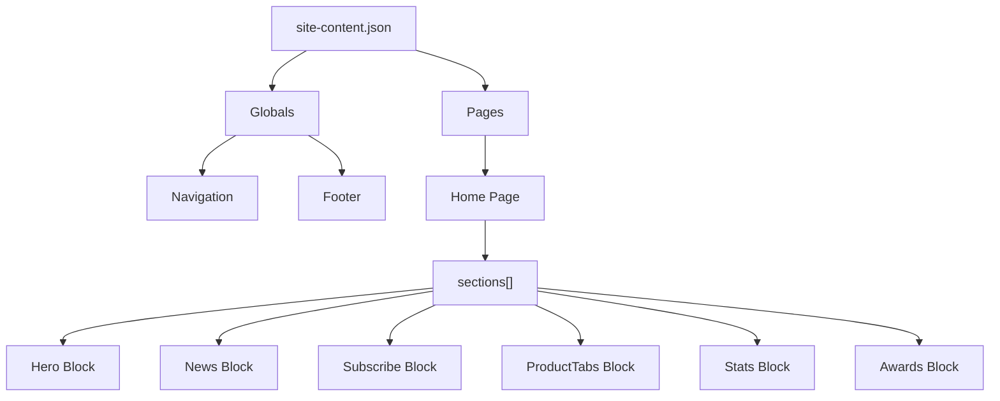

# CMS 콘텐츠 모델

## 목표

데모 단계에서는 DB 없이 JSON을 사용합니다. 하지만 JSON은 단순 임시 데이터가 아니라 실제 CMS로 옮길 수 있는 모델의 초안이어야 합니다.

핵심 모델은 다음과 같습니다.



## 최상위 JSON 구조

권장 파일:

```txt
src/content/demo-site.json
```

초안:

```json
{
  "site": {
    "name": "Penta Security",
    "locale": "ko-KR"
  },
  "navigation": {
    "logo": {
      "label": "Penta Security",
      "image": "/images/logo-penta.svg",
      "href": "/"
    },
    "items": [
      { "label": "Products", "href": "/products" },
      { "label": "Solutions", "href": "/solutions" },
      { "label": "Resources", "href": "/resources" },
      { "label": "Support", "href": "/support" },
      { "label": "Company", "href": "/company" }
    ],
    "search": {
      "enabled": true,
      "placeholder": "Search"
    }
  },
  "pages": {
    "home": {
      "slug": "/",
      "title": "Penta Security",
      "sections": []
    }
  },
  "footer": {
    "groups": [],
    "legal": {}
  }
}
```

## 페이지 모델

`pages.home.sections`는 블록 배열입니다. 섹션 순서 변경은 이 배열의 순서를 바꾸는 것으로 표현합니다.

```json
{
  "sections": [
    { "id": "home-hero", "type": "hero", "enabled": true, "data": {} },
    { "id": "home-news", "type": "news", "enabled": true, "data": {} },
    { "id": "home-subscribe", "type": "subscribe", "enabled": true, "data": {} },
    { "id": "home-products", "type": "productTabs", "enabled": true, "data": {} },
    { "id": "home-stats", "type": "stats", "enabled": true, "data": {} },
    { "id": "home-awards", "type": "awards", "enabled": true, "data": {} }
  ]
}
```

필드 규칙:

- `id`: 관리자 UI에서 정렬/수정 대상을 식별하는 안정적인 키
- `type`: 렌더링할 섹션 컴포넌트 타입
- `enabled`: 섹션 노출 여부
- `data`: 타입별 세부 필드

## Hero 블록

```json
{
  "id": "home-hero",
  "type": "hero",
  "enabled": true,
  "data": {
    "eyebrow": "믿을 수 있는 사회, 펜타시큐리티의 보안기술이 만들어 갑니다.",
    "title": "Technology\nFor Trust",
    "visualPreset": "default-geometric",
    "backgroundImage": null
  }
}
```

편집 가능:

- `eyebrow`
- `title`
- `visualPreset`
- `backgroundImage`

편집 제한:

- 도형의 개별 좌표/크기 조정은 제공하지 않습니다.

## News 블록

데모에서는 뉴스 항목을 블록 안에 직접 둡니다. 실제 프로젝트에서는 `news` Collection으로 분리하는 것을 권장합니다.

```json
{
  "id": "home-news",
  "type": "news",
  "enabled": true,
  "data": {
    "moreLink": {
      "label": "펜타시큐리티 소식 더 보기",
      "href": "/resources/news"
    },
    "items": [
      {
        "id": "news-001",
        "badge": "NEW",
        "title": "펜타시큐리티, ‘대한민국 IT서비스 혁신대상’ 과기정통부 장관상 수상",
        "date": "2025-11-17",
        "href": "/resources/news/news-001"
      }
    ]
  }
}
```

편집 가능:

- 뉴스 제목
- 날짜
- NEW 배지
- 링크
- 항목 순서

## Subscribe 블록

구독 영역은 사용자가 요청한 대로 문구, 입력 필드, 버튼 순서를 바꿀 수 있도록 `items[]` 배열로 모델링합니다.

```json
{
  "id": "home-subscribe",
  "type": "subscribe",
  "enabled": true,
  "data": {
    "layoutPreset": "text-input-button",
    "items": [
      {
        "id": "subscribe-text",
        "type": "text",
        "value": "뉴스레터를 구독하고 IT 및 보안 관련 소식을 받아보세요."
      },
      {
        "id": "subscribe-input",
        "type": "input",
        "name": "email",
        "placeholder": "E-mail을 입력해주세요"
      },
      {
        "id": "subscribe-button",
        "type": "button",
        "label": "구독하기",
        "href": "/subscribe"
      }
    ]
  }
}
```

권장:

- 데모에서는 `items[]` 순서 변경을 보여줍니다.
- 실제 프로젝트에서는 모바일 안정성을 위해 `layoutPreset`을 함께 사용합니다.
- 실제 구독 처리는 데모 범위가 아니라 별도 백엔드 요구사항으로 분리합니다.

## ProductTabs 블록

```json
{
  "id": "home-products",
  "type": "productTabs",
  "enabled": true,
  "data": {
    "headline": "펜타시큐리티는\n사이버 시큐리티 전 영역에 대한 해답을 제시합니다.",
    "tabs": [
      {
        "id": "damo",
        "label": "데이터 보안",
        "category": "암호 플랫폼",
        "productName": "D.AMO",
        "description": "국내 데이터 암호화 시장 점유율 1위, 최다 레퍼런스 암호화가 적용된 서버 20,000+ 일본, 이태리 등 해외 수출",
        "button": {
          "label": "자세히 보기",
          "href": "/products/damo"
        },
        "visual": {
          "type": "preset",
          "value": "lock"
        }
      },
      {
        "id": "wapples",
        "label": "웹 보안",
        "category": "지능형 WAPP 솔루션",
        "productName": "WAPPLES",
        "description": "WAPPLES 내용으로 수정 암호화가 적용된 서버 20,000+ 일본, 이태리 등 해외 수출",
        "button": {
          "label": "자세히 보기",
          "href": "/products/wapples"
        },
        "visual": {
          "type": "preset",
          "value": "web-application"
        }
      },
      {
        "id": "isign",
        "label": "인증 보안",
        "category": "인증 보안 플랫폼",
        "productName": "iSIGN",
        "description": "iSIGN 내용으로 수정 암호화가 적용된 서버 20,000+ 일본, 이태리 등 해외 수출",
        "button": {
          "label": "자세히 보기",
          "href": "/products/isign"
        },
        "visual": {
          "type": "preset",
          "value": "identity"
        }
      },
      {
        "id": "cloudbric",
        "label": "클라우드 보안",
        "category": "클라우드 SaaS 보안 플랫폼",
        "productName": "Cloudbric",
        "description": "클라우드 웹보안 SaaS 리더 SC Awards Europe ‘Best SME Security Solution’ 수상 일본, 북미, 유럽 등 글로벌 기업 고객 800+",
        "button": {
          "label": "자세히 보기",
          "href": "/products/cloudbric"
        },
        "visual": {
          "type": "preset",
          "value": "cloud"
        }
      }
    ]
  }
}
```

편집 가능:

- 탭 라벨
- 카테고리
- 제품명 또는 로고
- 설명
- 버튼
- 시각 에셋

## Stats 블록

```json
{
  "id": "home-stats",
  "type": "stats",
  "enabled": true,
  "data": {
    "items": [
      { "id": "customers", "label": "고객", "value": "9000+" },
      { "id": "branches", "label": "해외지사", "value": "일본 · 베트남 · 아랍에미리트" },
      { "id": "globalCustomers", "label": "글로벌 고객", "value": "800+" },
      { "id": "partners", "label": "글로벌 파트너", "value": "385" },
      { "id": "awards", "label": "제품기술 수상", "value": "47" },
      { "id": "patents", "label": "국내외 기술 특허", "value": "135" },
      { "id": "engineers", "label": "기술 인력 비중", "value": "60%+" }
    ]
  }
}
```

## Awards 블록

```json
{
  "id": "home-awards",
  "type": "awards",
  "enabled": true,
  "data": {
    "items": [
      {
        "id": "frost",
        "logo": "/images/awards/frost-sullivan.svg",
        "title": "비즈니스 컨설팅 기업 Frost & Sullivan",
        "description": "2024 Frost & Sullivan Best Practices Award에서 올해의 한국 웹 애플리케이션 방화벽 기업으로 선정되었습니다."
      },
      {
        "id": "gartner",
        "logo": "/images/awards/gartner.svg",
        "title": "글로벌 IT 시장조사기관 가트너(Gartner)",
        "description": "2023년 클라우드 웹 애플리케이션 및 API 보호 마켓 가이드에서 대표 벤더로 선정되었습니다."
      },
      {
        "id": "globee",
        "logo": "/images/awards/globee.svg",
        "title": "글로벌 비즈니스 시상식 Globee Award",
        "description": "2024 Globee Award에서 WAPPLES가 최고의 보안 하드웨어 부문 금상을 수상했습니다."
      }
    ]
  }
}
```

## Footer 모델

```json
{
  "footer": {
    "groups": [
      {
        "title": "Products",
        "items": [
          { "label": "Data Security", "href": "/products/data-security" },
          { "label": "Web Security", "href": "/products/web-security" },
          { "label": "Authentication Security", "href": "/products/authentication-security" },
          { "label": "SaaS", "href": "/products/saas" },
          { "label": "Cryptography", "href": "/products/cryptography" },
          { "label": "Individual Security", "href": "/products/individual-security" }
        ]
      }
    ],
    "legal": {
      "privacy": {
        "label": "개인정보 취급방침",
        "href": "/privacy"
      },
      "utilityLinks": [
        { "label": "문의하기", "href": "/support/contact" },
        { "label": "채용 정보", "href": "/company/careers" },
        { "label": "공식 블로그", "href": "/blog" }
      ],
      "companyInfo": "펜타시큐리티(주) 사업자 등록번호 : 116-81-65189, 대표 김태균 ISO 9001:2015 | ISO 14001:2015 | ISO 27001:2022",
      "copyright": "ⓒ 2024 Penta Security Inc. All rights reserved."
    }
  }
}
```

## Payload CMS 전환 매핑

| JSON 영역 | Payload 모델 | 비고 |
|---|---|---|
| `navigation` | Global `Navigation` | 메뉴 공통 관리 |
| `footer` | Global `Footer` | Footer 공통 관리 |
| `pages.home` | Collection `Pages` | slug 기반 페이지 |
| `sections[]` | Blocks field | Hero, News, Subscribe 등 |
| `news.items[]` | Collection `News` | 데모 후 상세 페이지 필요 시 분리 |
| `logo`, `visual`, `award.logo` | Upload Collection `Media` | MinIO 연동 |
| `products.tabs[]` | Block 내부 array 또는 Collection `Products` | 제품 페이지 확장 여부에 따라 결정 |

## 모델링 원칙

- JSON 필드명은 실제 CMS 필드명으로 그대로 가져갈 수 있게 의미 중심으로 짓습니다.
- 화면 좌표나 픽셀 값은 콘텐츠 데이터에 넣지 않습니다.
- 편집자가 바꿔야 하는 값과 개발자가 통제해야 하는 스타일 값을 분리합니다.
- 콘텐츠는 구조화하고, 디자인은 컴포넌트와 디자인 토큰에서 처리합니다.
