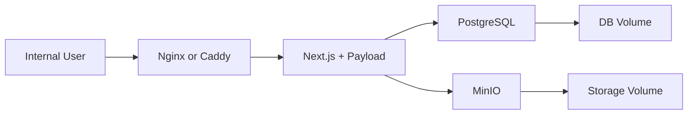

# 펜타시큐리티 웹사이트/CMS 개발 계획

## 목표

펜타시큐리티 웹사이트 개편은 두 단계로 진행합니다.

1. 회의용 데모를 먼저 제작해 관련자들이 "편집 가능한 웹사이트"의 사용 경험을 확인한다.
2. 데모 피드백으로 실제 요구사항을 확정한 뒤, 같은 프로젝트 폴더에서 정식 CMS와 사내망 Docker 운영 구조로 확장한다.

이번 프로젝트의 핵심은 범용 페이지 빌더를 만드는 것이 아닙니다. 목표는 정해진 디자인 시스템 안에서 마케터가 텍스트, 링크, 이미지, 뉴스, 메뉴, 섹션 순서를 직접 수정할 수 있는 맞춤형 CMS를 만드는 것입니다.

## 전체 단계

### 0단계: 기준 정리

산출물:

- `docs` 문서 세트
- 데모 범위와 제외 범위
- Figma/ref-image 기반 디자인 시스템 초안
- JSON 콘텐츠 모델 초안

주요 결정:

- 데모는 JSON 기반으로 만든다.
- 실제 DB와 Storage는 데모 이후 붙인다.
- 데모 코드는 버리지 않고 실제 프로젝트의 컴포넌트 기반으로 확장한다.

### 1단계: JSON 기반 데모 스캐폴딩

상태: 완료

목표:

- 현재 `penta-cms` 폴더에 Next.js 기반 데모 앱을 만든다.
- `ref-image`와 Figma의 4개 프레임을 기준으로 메인 페이지를 구현한다.
- 데이터는 우선 `src/content/demo-site.json` 같은 JSON 파일에서 읽는다.

권장 구조:

```txt
penta-cms/
  docs/
  ref-image/
  src/
    app/
      page.tsx
      admin-demo/
        page.tsx
    components/
      layout/
      sections/
      ui/
    content/
      demo-site.json
    lib/
      content/
```

중요 원칙:

- 섹션 컴포넌트는 JSON 파일을 직접 import하지 않고 props만 받는다.
- 데이터 로딩 책임은 `lib/content`에 둔다.
- 관리자 데모는 `/admin-demo`로 격리한다.

### 2단계: 공개 페이지 데모

상태: 완료

목표:

- `C type_01`~`C type_04`의 공통 레이아웃을 하나의 메인 페이지로 구현한다.
- 제품 탭 상태에 따라 제품 콘텐츠만 바뀌도록 구성한다.

구현 섹션:

- Header
- Hero
- News
- Subscribe
- ProductTabs
- Stats
- Awards
- FooterNavigation
- FooterLegal

검증 기준:

- 데스크톱 기준 1920px 시안의 비례와 주요 간격이 유지된다.
- 제품 탭 클릭 시 D.AMO, WAPPLES, iSIGN, Cloudbric 콘텐츠가 전환된다.
- 모든 텍스트와 버튼 링크가 JSON 데이터로부터 렌더링된다.

완료 메모:

- `ref-image/main_01.png`와 `ref-image/main_01.html`을 기준으로 Header, Hero, News, Subscribe, ProductTabs, Stats, Awards, FooterNavigation, FooterLegal의 데스크톱 정밀 보정을 완료했습니다.
- Header 로고/메뉴/검색/언어 아이콘, Hero 도형 크기와 레이어, News 목록과 구독 카드, 제품 탭과 제품별 CSS 비주얼, 통계 카드, 푸터 메뉴/회사 정보 레이아웃을 시안 기준으로 조정했습니다.
- 제품별 비주얼은 `src/components/visuals/figma-visuals.tsx`에서 CSS 도형으로 렌더링하며, Cloudbric 구름 도형은 `ref-image/products-visual/mask-cloud.png` 마스크를 사용합니다.
- Awards는 `src/components/sections/awards-carousel.tsx` 클라이언트 컴포넌트로 분리해 3개 초과 아이템에서 자동 Carousel, hover pause, dot navigation을 제공합니다.
- 콘텐츠는 `src/content/demo-site.json`에서 계속 관리하며, 뉴스/제품 설명/수상/푸터 메뉴 텍스트를 데모 기준으로 갱신했습니다.
- 검증: `npm run typecheck` 통과. 커밋 전 `npm run lint`, `npm run build`를 추가 확인합니다.

### 2.5단계: 공개 페이지 반응형 보정

상태: 계획 수립

목표:

- 2단계에서 완성한 데스크톱 공개 페이지 디자인을 유지하면서 모바일/태블릿 사용성을 보강한다.
- 반응형 대상 범위를 메인 페이지 1개와 데모용 D.AMO 서브 페이지 2개로 확장한다.
  - 메인 페이지: `/`
  - D.AMO 개요 페이지: `/products/data-security`
  - D.AMO 라인업 상세 페이지: `/products/data-security/on-application`, `/products/data-security/on-db`, `/products/data-security/on-os`
- Header, Hero, News, Subscribe, ProductTabs, Stats, Awards, FooterNavigation, FooterLegal과 서브 페이지 Hero, Benefits, Lineup, Detail tabs/cards, FAQ에 breakpoint별 레이아웃을 정의한다.
- 데모 미팅 전 모바일 화면에서도 주요 콘텐츠 탐색, 제품 탭 전환, 라인업 상세 탭 전환, 수상 Carousel 확인이 가능하게 한다.

구현 방향:

- Header는 모바일에서 햄버거 버튼과 sheet/drawer 메뉴를 사용하며, 데스크톱 full down wide menu와 같은 메뉴 구조를 재사용한다.
- ProductTabs는 모바일에서 탭, 제품 설명, 비주얼 순서로 배치하고 제품 비주얼은 축소해 아래에 배치한다.
- D.AMO 개요 페이지는 모바일에서 Hero 비주얼, Benefits 카드, 라인업 링크 카드, FAQ가 1열 중심으로 자연스럽게 흐르도록 조정한다.
- D.AMO 상세 페이지는 공통 `TabLink` 기준으로 탭을 좌측 정렬/자동 줄바꿈하고, 상세 카드 본문은 작은 화면에서 padding과 타이포를 줄인다.
- Awards Carousel은 모바일에서 한 번에 1개 아이템을 보여주는 구조를 우선 검토한다.
- Footer 메뉴는 모바일에서 accordion 구조를 우선 후보로 둔다.

상세 계획:

- `docs/RESPONSIVE_IMPLEMENTATION_PLAN.md`에서 섹션별 현재 문제점, 권장 모바일 UI, 선택 가능한 대안, 구현 우선순위, 검증 기준을 관리한다.

### 3단계: 관리자 데모

목표:

- 관련자들이 마케터 관점에서 편집 경험을 확인할 수 있도록 `/admin-demo`를 만든다.
- 실제 인증/권한/DB 저장은 제외하되, 편집 UI와 데이터 구조는 실제 CMS 전환을 고려한다.

편집 항목:

- 상단 메뉴 텍스트와 링크
- Hero 문구
- 뉴스 목록
- 구독 영역의 문구, 입력 필드, 버튼, 순서
- 제품 탭별 라벨, 제목, 설명, 버튼 링크, 시각 에셋
- 통계 항목
- 수상 로고, 제목, 설명
- Footer 메뉴와 법무/회사 정보
- 메인 섹션 순서

데모 저장 방식:

- 1차 구현은 브라우저 localStorage 또는 클라이언트 상태로 편집 흐름을 보여준다.
- 파일 저장까지 필요하면 별도 요구로 분리한다. 데모 미팅 목적이라면 실제 파일 쓰기보다 "편집 후 미리보기"가 중요하다.

### 4단계: 데모 미팅과 요구사항 확정

목표:

- 데모를 보여주고 실제 운영자가 원하는 편집 범위를 확정한다.
- "자유 편집"과 "통제된 편집"의 경계를 합의한다.

주요 질문:

- 섹션 순서 변경만 필요한가, 섹션 추가/삭제도 필요한가?
- 뉴스/보도자료는 단순 목록인가, 상세 페이지와 카테고리가 필요한가?
- 다국어가 필요한가?
- 승인/검수/예약 발행이 필요한가?
- 관리자 권한은 몇 단계가 필요한가?

자세한 질문 목록은 [REQUIREMENTS_WORKSHOP.md](./REQUIREMENTS_WORKSHOP.md)를 기준으로 한다.

### 5단계: 실제 CMS 설계

목표:

- 데모 JSON 모델을 Payload CMS의 Collections, Globals, Blocks로 전환한다.
- PostgreSQL과 MinIO를 붙인다.
- `/admin-demo`에서 검증한 편집 경험을 실제 `/admin` CMS로 옮긴다.

권장 매핑:

- `navigation`, `footer` → Payload Globals
- `pages.home.sections[]` → Payload Blocks
- `news.items[]` → `news` Collection
- `media` → Payload Uploads + MinIO
- `products` → Product tabs용 Collection 또는 Global

### 6단계: Docker 기반 운영 전환

목표:

- 사내 내부망에서 Docker Compose로 운영 가능한 구조를 만든다.
- 앱, PostgreSQL, MinIO, Nginx/Caddy를 분리한다.

권장 운영 구성:



운영 전 필수 확인:

- 백업/복구 리허설
- `/admin` 내부망 접근 제한
- 환경변수 분리
- MinIO public URL과 internal endpoint 분리
- 이미지 업로드 보안 검증

## 일정 예시

| 단계 | 기간 | 결과 |
|---|---:|---|
| 문서/설계 | 1~2일 | 범위와 모델 확정 |
| 데모 스캐폴딩 | 1일 | Next.js 구조와 JSON 로더 |
| 공개 페이지 데모 | 2~4일 | Figma 기반 메인 페이지 |
| 공개 페이지 반응형 보정 | 1~2일 | 모바일/태블릿 공개 페이지 |
| 관리자 데모 | 2~4일 | 편집 가능한 데모 UI |
| 미팅/요구사항 정리 | 1~2일 | 실제 CMS 범위 확정 |
| 실제 CMS 구축 | 3~6주 | Payload + DB + Storage |
| 운영 준비 | 1~2주 | Docker, 보안, 백업, 배포 |

## 성공 기준

- 관련자가 데모를 보고 "무엇을 직접 수정할 수 있는지" 명확히 이해한다.
- 데모 후 실제 프로젝트 요구사항이 항목 단위로 정리된다.
- 데모의 섹션 컴포넌트와 콘텐츠 모델이 실제 Payload 전환 시 재사용된다.
- 사내망 Docker 운영 전환 시 데이터, 파일, 환경변수 구조가 다시 설계되지 않는다.
