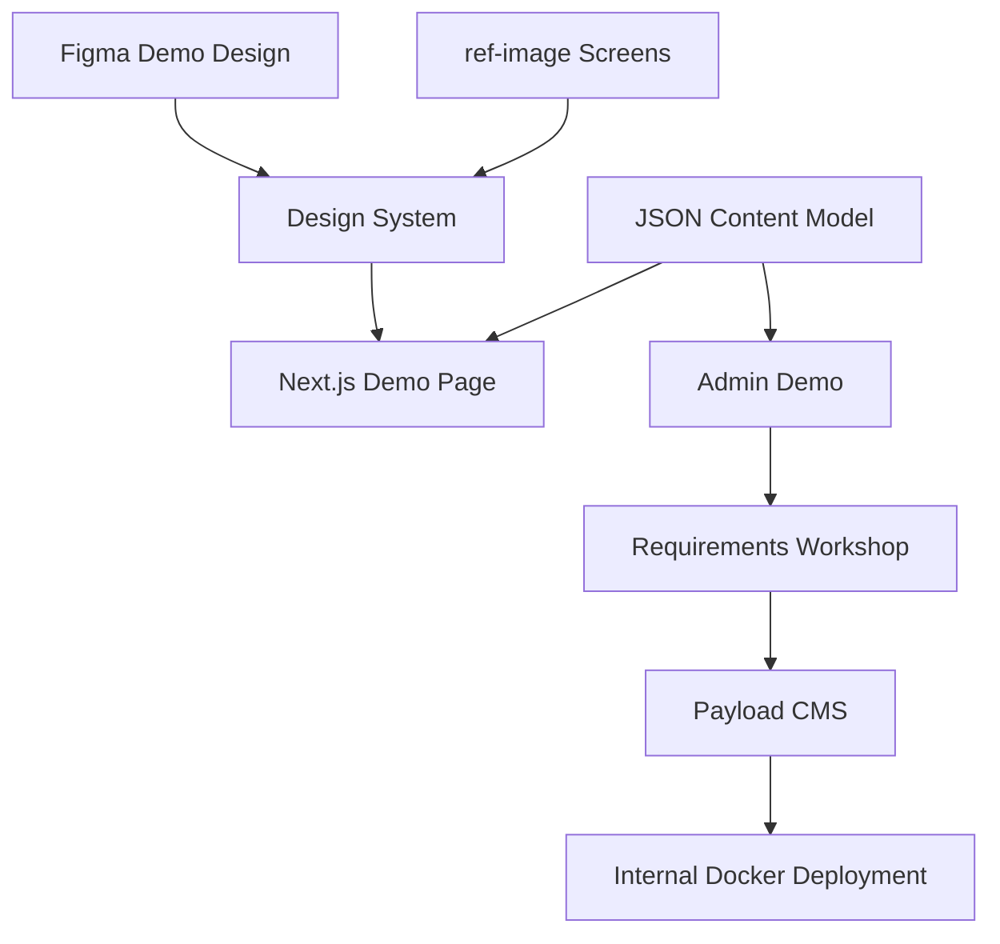

# 펜타시큐리티 웹사이트/CMS 문서

이 문서 묶음은 펜타시큐리티 웹사이트 개편을 바로 전체 구현으로 시작하지 않고, 먼저 회의용 데모를 만든 뒤 실제 요구사항을 수집하고 본 프로젝트로 확장하기 위한 기준 문서입니다.

현재 데모 기준 디자인은 `ref-image/main_01.png`부터 `ref-image/main_04.png`까지의 이미지와 Figma 파일 `penta website demo`의 4개 프레임(`C type_01`~`C type_04`)입니다. 4개 화면은 동일한 메인 페이지 구조를 공유하며, 제품 탭 상태에 따라 D.AMO, WAPPLES, iSIGN, Cloudbric 콘텐츠가 바뀌는 형태입니다.

## 문서 구성

- [PROJECT_PLAN.md](./PROJECT_PLAN.md): 데모 제작부터 실제 CMS/운영 구축까지의 전체 단계 계획
- [DEMO_SCOPE.md](./DEMO_SCOPE.md): 회의용 데모의 구현 범위, 제외 범위, 검증 포인트
- [DESIGN_SYSTEM.md](./DESIGN_SYSTEM.md): Figma와 참고 이미지 기반 디자인 시스템 초안
- [CMS_CONTENT_MODEL.md](./CMS_CONTENT_MODEL.md): JSON 기반 데모 콘텐츠 모델과 Payload CMS 전환 방향
- [LOCAL_AND_DOCKER.md](./LOCAL_AND_DOCKER.md): 로컬 개발, Docker 검증, 사내망 운영 전환 기준
- [REQUIREMENTS_WORKSHOP.md](./REQUIREMENTS_WORKSHOP.md): 데모 미팅에서 확인할 질문과 의사결정 체크리스트

## 기본 방향

데모는 실제 DB 없이 JSON 데이터를 사용합니다. 하지만 데모용 JSON 구조는 추후 Payload CMS의 Blocks 모델로 옮기기 쉽도록 `page.sections[]` 기반으로 설계합니다.

공개 웹사이트 컴포넌트는 데이터 출처를 몰라야 합니다. 데모 단계에서는 JSON을 읽고, 실제 프로젝트 단계에서는 Payload CMS, PostgreSQL, MinIO에서 데이터를 가져오더라도 같은 컴포넌트를 재사용할 수 있어야 합니다.

관리도구는 워드프레스처럼 완전 자유로운 페이지 빌더를 목표로 하지 않습니다. 목표는 이미 정해진 디자인 안에서 텍스트, 이미지, 버튼, 링크, 뉴스, 수상 항목, 메뉴, 섹션 순서를 안전하게 편집할 수 있는 "통제된 테마 빌더"입니다.

## 큰 흐름

## 현재 중요한 전제

- 데모는 현재 `penta-cms` 폴더에서 시작하고, 같은 폴더에서 실제 프로젝트로 확장합니다.
- 데모 개발은 로컬 `npm run dev` 중심으로 빠르게 진행합니다.
- Docker는 데모 초기에 무겁게 붙이지 않되, 실제 운영 방향을 고려해 컨테이너 실행 가능성은 초기에 검증합니다.
- Figma 변수 정의는 현재 비어 있으므로 디자인 시스템은 화면 구조, 치수, 텍스트 위계, 시각 패턴을 기준으로 추론해 시작합니다.
- 실제 프로젝트 단계에서는 Payload CMS + PostgreSQL + MinIO + Docker Compose를 우선 후보로 둡니다.
